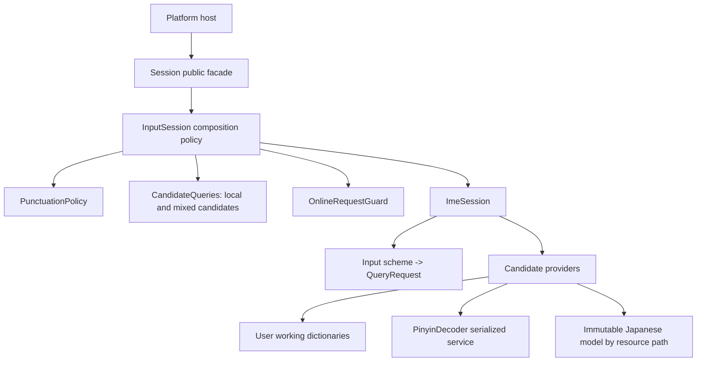

# Runtime architecture and platform API

Engine owns portable input behavior. Platform hosts own native keys, UI, permissions,
network transport and text insertion. The supported entry point for new platform code is
`<metasequoia/session.h>`; link `MetasequoiaIme::Engine`. It exposes options, editing intents,
value snapshots and asynchronous candidate requests, without exposing SQLite or providers.



`InputSession` remains the compatibility/advanced interface for existing hosts. Its raw
sequence setters and engine-key methods are not part of the new `Session` API. Existing
frontends can migrate independently after the producer commit merges; this change does not
move their locks to an unmerged producer. Do not expand the compatibility interface for
new platform features when they can use editing intents and snapshots.

Desktop hosts may call `finish(highlighted_index)` to commit the highlighted first candidate
and all remaining segments through Engine's existing composition policy. `finish()` retains
the leading-candidate behavior. Snapshots include `dedicated_english` even with empty preedit,
so hosts need not maintain a second mode flag. `set_helpcode_enabled` applies to both pinyin
schemes; a host with separate persisted preferences applies the selected flag on scheme change.

For the Microsoft shuangpin profile, `character(';')` routes the ing final through the
decoder's existing position validation. Other profiles leave this character unhandled.

`MoveLeft`, `MoveRight`, `MoveHome`, `MoveEnd` and `DeleteForward` are composition
commands. `character` inserts at the session-owned caret; `Backspace` erases before it.
Snapshots append `editing_text` (the ASCII source input, preserving case) and
`caret_position` (its byte offset). These are distinct from rendered preedit, notably
for Japanese romaji conversion. Hosts render the snapshot instead of rewriting raw input.
Movement alone preserves candidate/request identity; mutations invalidate online requests
even when subsequent edits restore identical spelling. Selection places the caret at the
end of any unconsumed suffix; cancel and scheme changes reset it. Local-mode markers
remain protected from middle editing; backspace on a marker-only composition still cancels.
Empty-composition movement is unhandled so normal host navigation can proceed.

`pin(index)` promotes a currently visible dictionary candidate without selecting it or changing
preedit. It persists through the session's user journal and working dictionaries, then refreshes
the snapshot. Explicit pinning works even when automatic learning is disabled. Pinyin (including
shuangpin canonical keys), Wubi and English dictionary candidates use their existing ranking
policy; generated, expressive, online and Japanese candidates are unhandled. English pinning
changes dictionary order within the existing mixed/temporary-mode layout, so it does not move
an English completion ahead of the temporary mode's raw-text entry. Invalid indices are unhandled;
a failed write returns a handled result with a diagnostic and no commit. Hosts serialize this
index action against the snapshot they display, just as they do for `select(index)`.

`remove(index)` deletes a visible dictionary phrase without committing text or changing preedit.
It uses the exact canonical pinyin key (or Wubi/English key), writes a deletion journal entry,
and refreshes candidates. Automatic learning may be disabled. Single-character non-English
candidates and non-dictionary sources are protected and return unhandled, as do invalid indices.
A database or journal failure returns a diagnostic with no commit. The working-dictionary delete
and journal entry share an attached SQLite transaction, so a statement/commit failure rolls back
both; this does not promise multi-file power-loss atomicity when SQLite uses WAL. Existing
quanpin/shuangpin and English deletion callers share this persistence helper. Hosts serialize
candidate-index actions against their displayed snapshot.

## Resources and user state

The host first verifies the downloaded bundle using `contracts/assets/product.py` and its
pinned ZIP digest, extracts it into an immutable resource directory, and supplies that
content ID to `prepare_runtime_paths`. All directory paths must be absolute. For this
generation-preparation API, resources, user data and cache must be disjoint directory trees:
none may equal or contain another, including through resolved symlinks. Invalid roots are
rejected before creating directories or copying databases. The legacy layout remains available
through `RuntimePaths::legacy()` for consumers that have not yet migrated.

```cpp
#include <metasequoia/session.h>

// Quiesce sessions and user-data writers while preparing/switching generations.
auto paths = metasequoia::prepare_runtime_paths(
    resource_directory, user_directory, cache_directory, verified_bundle_digest);
metasequoia::SessionOptions options;
options.paths = paths;
options.helpcode_schema = "xiaohe";
metasequoia::Session session(options);

auto result = session.character('n');
// The host inserts result.commit when present, then renders this value snapshot.
auto view = session.snapshot();
```

The directory ownership is explicit:

| Directory | Contents and lifecycle |
| --- | --- |
| `resources` | Verified immutable DB inputs, models, helpcodes, translation sidecar, notices |
| `user_data` | Durable `msime_user.db`, decoder user dictionary, and working DB generations |
| `user_data/dictionaries/<content ID>` | Writable `msime.db`/`english.db` copies used by learning |
| `cache` | Disposable host cache; deleting it must not delete user dictionaries |

Preparation copies both desktop DBs using SQLite backup (including committed WAL data),
replays the existing journal inside the existing replay transaction, then publishes the new
generation with one directory rename. Failed preparation removes only its staging directory
and does not switch the host or replace an old generation. Returning to an existing
prepared generation replays the current journal so newer learning survives a rollback.
The host switches only after preparation succeeds, and retains generations for its rollback
policy. An existing `.incoming` directory is reported rather than silently deleted; after
confirming no preparation is active, the host may remove that interrupted staging directory.

Preparation currently targets the full desktop dictionary profile. Other product layouts
may supply explicit `RuntimePaths`; they must provide durable writable DBs and preserve
journal replay themselves. `RuntimePaths::legacy()` captures the old environment/default
layout once for compatibility. Existing sessions are never redirected by later environment
changes. Directories and models must not be replaced in place while a session uses them.

Translation overlays are loaded from `resources` even when `english.db` is a writable user
copy. File names and helpcode scheme mappings come from generated `contracts/assets/assets.h`.

## Isolation and lifetime

A host serializes calls on each session. Different sessions may run concurrently and can
use different paths, profiles and helpcode schemes. Profiles are owned values, helpcode
maps are immutable per-session values, and the Japanese model cache is keyed by resource
path with weak ownership. Unused or failed models are not held forever by a global future.
`set_helpcode_schema()` affects only that session. Legacy static `select_helpcode_schema()`
changes the default for subsequently created sessions; it no longer changes live sessions.

Google Pinyin internally uses global search, spelling, language-model and lemma-cache state.
`PinyinDecoder` is the sole caller of its C API. One mutex covers model/user selection,
model-specific cache reset, search reset, search and copying the resulting text. Construction
of another dictionary no longer destroys a live decoder. Changing model/user paths closes
and reloads the service; the last decoder client closes its resources. Calls never retain
upstream candidate pointers or incremental search state. This makes independent sessions
safe while serializing their fallback decode work. Windows decoder file IO uses namespace
adapters for UTF-8 paths without modifying the pinned submodule or process locale.

User journal operations own their SQLite connections, so separate calls cannot accidentally
join another session's transaction through a process-wide connection. SQLite locking still
coordinates writes to the same user's databases. Resource upgrades must quiesce writers.

Online requests contain both a session ID and a composition generation. Hosts copy the
entire request unchanged through their asynchronous transport. A response from another
session is rejected even if the two sessions contain identical input.

## Verification

The root CTest targets include public-header compilation, two independent resource/user
layouts, per-session helpcodes and punctuation, local query paths, concurrent sessions,
Japanese model path isolation, real Google Pinyin model interleaving/concurrency, Unicode
resource paths, user phrase replay, return to a previous generation and failed replay
preserving old working data. Existing candidate, learning, temporary-mode and online tests
continue to exercise the compatibility layer and extracted components.

```bash
python3 contracts/assets/generate.py --check
python3 -m unittest discover -s tests -p test_build_assets.py
cmake -S . -B build -DCMAKE_BUILD_TYPE=Release
cmake --build build --parallel
ctest --test-dir build --output-on-failure --timeout 20
```

The dictionary-build workflow also runs `dictionary/tests/consumer/run_runtime.py` against
its complete produced archive. The runner checks the archive digest and clean producer commit,
extracts into a temporary directory and invokes the same-checkout `runtime_consumer`. This
exercises public Session queries, learning, generation replay, rollback, cache disposal and
failed preparation using real dictionary tables, then verifies every immutable resource digest
again. The generation test reuses the same produced profile to isolate lifecycle behavior;
it does not replace platform installation or upgrade tests between different product releases.
